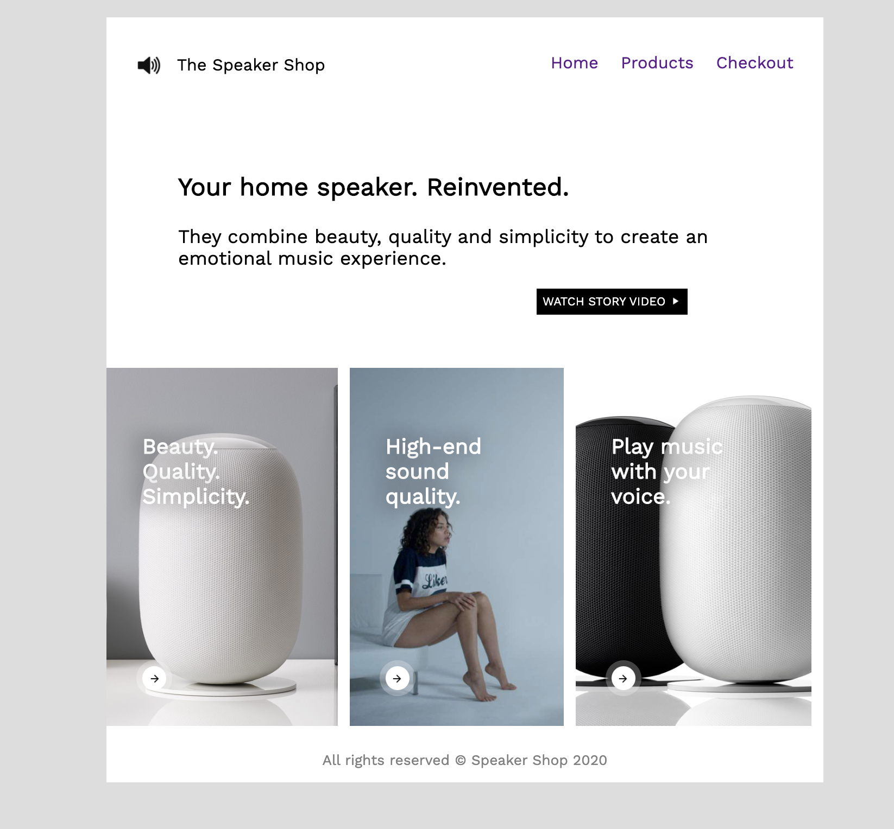

# Speaker Shop Design
Stelle das untenstehende Mock-up so genau wie möglich nach und verwende dabei Flexbox, Positioning und Prinzipien des UI/UX-Designs.

### Design-Mock-up

## Anleitung
- Auf deiner Website sollen drei Produkte angezeigt werden. Positioniere die Produkte mit Flexbox.
- Erstelle mindestens 3 Links in deiner Navigationsleiste.
- Vergiss das `footer` Element nicht.
- Achte darauf, dass du semantisch korrekte HTML-Elemente verwendest, d.h. `<header>`, `<nav>`, `<main>`, `<footer>` usw.
- Nutze das Mock-up als Vorlage, aber du kannst auch deinen eigenen Stil einbringen.

### Bonus

- Mach die Seite vollständig responsive
- Erstelle und verlinke weitere Seiten

Schriftart: *Work Sans* von **Google Fonts**
